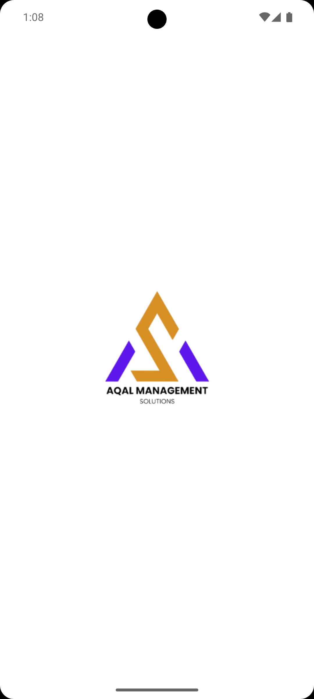
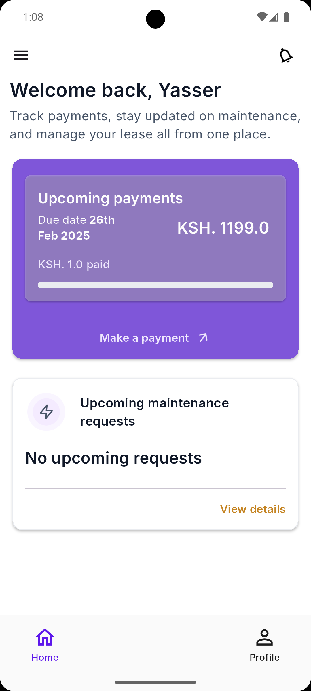
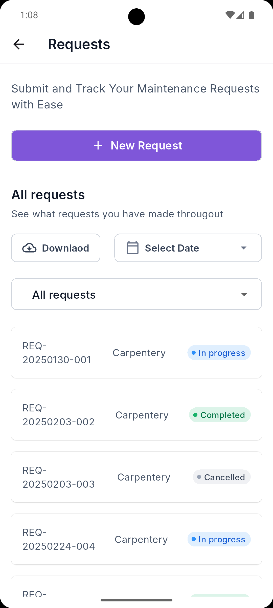
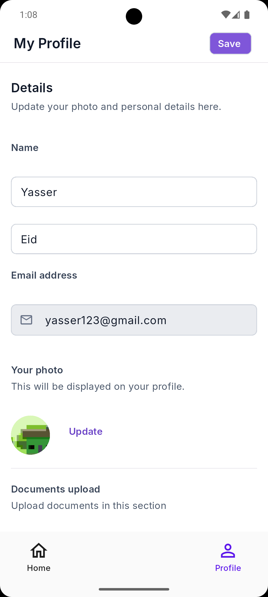
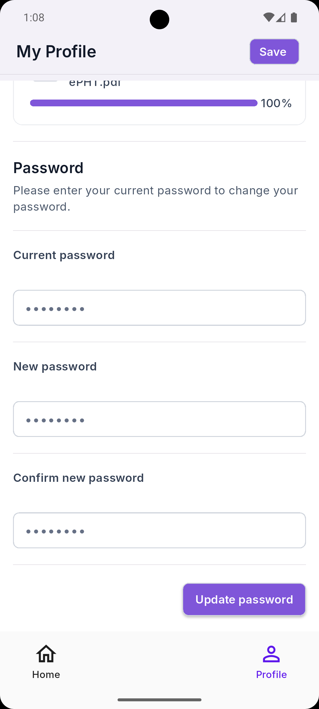
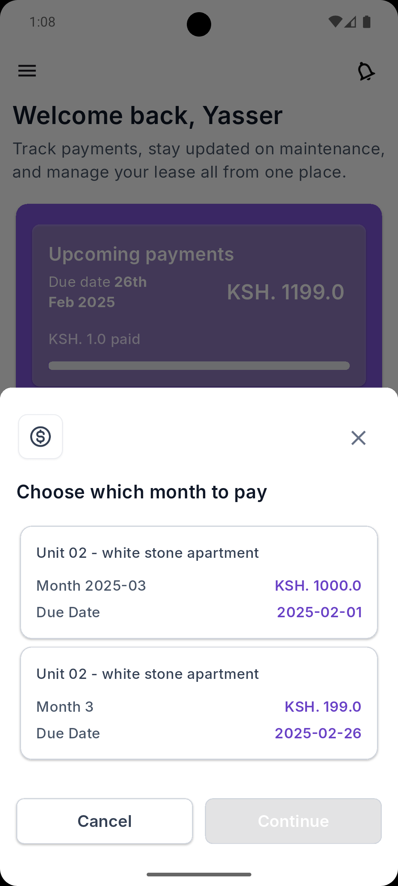

# 🚀 AQAL App Demo  

## 📱 Screenshots  

  
  
  
  
  
  

   

## 📖 About  
Aqal is a powerful property management app designed to simplify rent payments and tenant interactions. Tenants can easily pay their monthly rent, submit maintenance requests, and receive real-time updates and notifications. Stay informed and manage your rental experience effortlessly with Aqal!  

## 🚀 App Store Status  
- ✅ Submitted for review    
- 📢 Released Now!  

## 📥 Download APK 
[Download](https://play.google.com/store/apps/details?id=com.aqalmanagment.app)  

---

## 🛠️ Technologies Used  

### **👨‍💻 Core Technologies**  
- **Flutter** – Cross-platform app development  
- **Dart** – Programming language  

### **🛠️ State Management & Dependency Injection**  
- **Flutter Bloc** – State management using Bloc and Cubit  
- **GetIt** – Dependency injection  

### **📡 Networking & API Handling**  
- **Dio** – HTTP client for API requests  
- **Retrofit** – Type-safe HTTP client for API calls  
- **Json Serializable & Json Annotation** – JSON serialization  

### **🌍 Localization & Internationalization**  
- **Intl** – Formatting dates, numbers, and currencies   
- **Timeago** – Relative time formatting  

### **🖼️ UI & UX Enhancements**  
- **Cupertino Icons** – iOS-style icons  
- **Flutter ScreenUtil** – Responsive UI scaling  
- **Cached Network Image** – Efficient image caching  

### **📂 Storage & File Handling**  
- **Shared Preferences** – Storing small data locally  
- **Flutter Secure Storage** – Encrypted storage  
- **Path Provider** – Accessing file system paths  
- **PDF** – Generating and handling PDFs  

### **🔔 Notifications & Background Services**  
- **Firebase Messaging** – Push notifications  
- **Flutter Local Notifications** – Handling in-app notifications  

### **📎 File & Media Management**  
- **File Picker** – Selecting files  
- **Open File** – Opening files  
- **Image Picker** – Picking images  

### **🚀 App Enhancements & Customization**  
- **Flutter Native Splash** – Custom splash screen  
- **Flutter Launcher Icons** – Custom app icons  

### **🔥 Firebase Services**  
- **Firebase Core** – Connecting to Firebase  
- **Firebase Messaging** – Push notifications  

---

## 📢 Stay Updated  
The app will be available soon on:  
- 📱 **Google Play Store**: *Available now*  
- 🍏 **Apple App Store**: *Coming Soon*  
